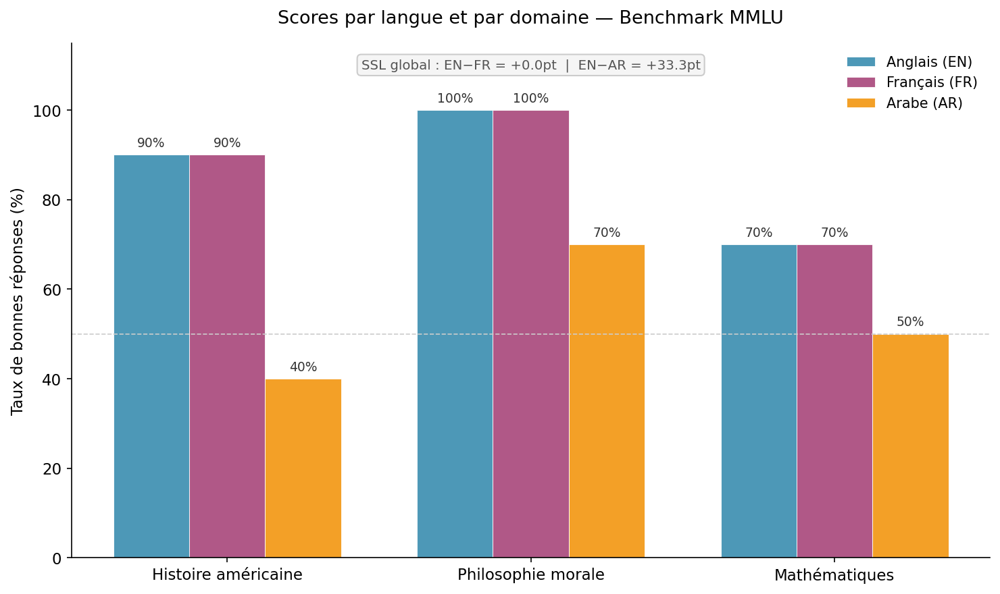

# M2-IREN-Exp-rience---exercice-2
Audit technique du benchmark MMLU : mesure de l'instabilité linguistique et des biais culturels (SSL &amp; Indice R). Étude empirique sur le modèle Phi-3 via Ollama. Projet Master IREN.

##  Résultats Clés
* **SSL Global (Score de Sensibilité Linguistique) :** 16.67 (Biais Fort)
* **Instabilité :** 40% des items changent de réponse selon la langue.

## Méthodologie
Nous utilisons un pipeline Python automatisé interrogeant le modèle **Phi-3** en local (via Ollama) avec une température de 0.0 pour garantir le déterminisme des tests sur un corpus trilingue (EN, FR, AR).

## Utilisation
1. `python run_experiment.py` : Exécution de l'audit.
2. `python metrics.py` : Calcul du SSL et de l'Indice R.
3. `python visualize.py` : Génération des visualisations.
